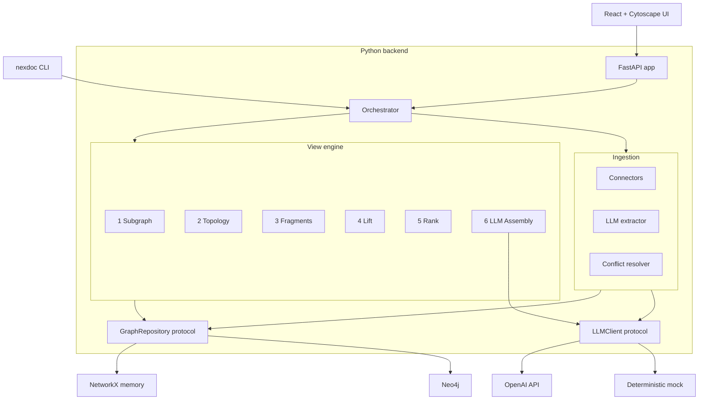

# NexusDocs

> **Topology-aware knowledge graph documentation.**
> A Python + React platform that turns your services, teams, and policies into
> a navigable knowledge graph and renders it as a continuous-zoom narrative
> tailored to who is reading.


[](PRD.md)
[](backend/)
[](frontend/)
[](docker-compose.yml)
[](LICENSE)

---

## Table of contents

- [What is NexusDocs?](#what-is-nexusdocs)
- [Screenshot gallery](#screenshot-gallery)
- [Quick start (Docker)](#quick-start-docker)
- [Quick start (local Python)](#quick-start-local-python)
- [`nexdoc` CLI tour](#nexdoc-cli-tour)
- [Architecture](#architecture)
- [Development](#development)
- [Project layout](#project-layout)
- [Documentation](#documentation)
- [License](#license)

---

## What is NexusDocs?

Your services, teams, runbooks, on-call rotations, Kafka topics and Confluence
pages all describe the same organization — but they live in eight different
tools, at three different altitudes, and rot independently.

NexusDocs models them as **one knowledge graph**:

- **Entities** are nodes — companies, divisions, teams, people, services,
  databases, Kafka topics, API endpoints, even individual classes and
  functions.
- **Relationships** are edges — `belongs_to`, `owns`, `calls_api`, `publishes_to`,
  `consumes_from`, `depends_on`, …
- **DocFragments** are the prose — anchored to one or more entities/edges,
  tagged with a **lens** (`technical`, `operations`, `onboarding`, `debug`,
  `product`, `client`) and a **zoom range** (0 = galaxy, 100 = line of code).

At read time, you give NexusDocs a **focus entity** + a **zoom level** + a
**lens**. It pulls the surrounding subgraph, ranks it by topology and your
recent navigation, picks the matching fragments, and asks an LLM to assemble
the result into a cohesive narrative with a Mermaid diagram.

**Same graph, infinite views.** A director sees teams and ownership; an
engineer sees the same call graph at the API/SQL/Kafka level; the on-call sees
the failure modes — without context-switching across tools.

| Surface | Path | Notes |
|---|---|---|
| Python backend | [`backend/`](backend/) | Pydantic v2 models, FastAPI app, view engine, ingestion pipeline. |
| `nexdoc` CLI | [`backend/src/nexusdocs/cli/`](backend/src/nexusdocs/cli/) | `apply`, `render`, `search`, `ingest`, `serve`. |
| React frontend | [`frontend/`](frontend/) | Vite + React + TypeScript + Cytoscape.js + Mermaid. |
| Compose stack | [`docker-compose.yml`](docker-compose.yml) | API + Neo4j + UI + one-shot seed loader. |
| Documentation | [`docs/`](docs/README.md) | Concepts, schemas, framework, examples, [usage guide](docs/USAGE.md). |

> **Status**: Phases 1–3 of the [PRD](PRD.md) are implemented. Foundation,
> LLM ingestion, and the topology-aware view engine are all live. Phase 4+
> (Confluence/JIRA/OpenAPI/Backstage connectors, VS Code extension, impact
> analysis, drift detection, semantic search) are explicit Protocol seams in
> the codebase, ready to plug in.

---

## Screenshot gallery

Six tours of the same graph at different altitudes and from different angles.
Click any thumbnail to view full-size.

### The continuous zoom axis

| Zoom 10 — *galaxy*  |  Zoom 25 — *country*  | Zoom 50 — *city*    |  Zoom 80 — *street* |
|:--:|:--:|:--:|:--:|
| Top-level systems & orgs only. The whole company in one frame. | Default view — divisions, major systems. | Teams & services start to crowd in. | Individual services, queues, endpoints. |
| [](docs/images/02-view-zoom10-galaxy.png) | [](docs/images/01-overview-zoom25.png) | [](docs/images/03-view-zoom50-systems.png) | [](docs/images/04-view-zoom80-services.png) |

### Focus, lenses, ingestion, search

| Focused on `system.payments` | Multi-lens (technical + operations + debug) | Ingest a markdown doc | Search across the graph |
|:--:|:--:|:--:|:--:|
| Subgraph + topology + fragments rendered for one system. | Toggling lenses changes which DocFragments make the cut. | Paste any markdown; the LLM extracts entities, edges and child fragments. | Free-text across entities, relationships and fragments. |
| [](docs/images/05-view-focus-system-payments.png) | [](docs/images/06-view-multi-lens.png) | [](docs/images/07-ingest-markdown.png) | [](docs/images/13-search-detail.png) |

### Settings, ingestion connectors, help, about

| Ingestion tabs (markdown / git / Confluence / Jira) | Help & concepts cheat-sheet | About — graph at a glance | Settings — runtime LLM bindings |
|:--:|:--:|:--:|:--:|
| Four connectors share one extraction pipeline. | One-page glossary covering everything in the UI. | Live counts of entities, edges, fragments by lens. | Override the OpenAI key, model, or base URL at runtime. |
| [](docs/images/08-ingest-tabs.png) | [](docs/images/10-help.png) | [](docs/images/11-about.png) | [](docs/images/12-settings.png) |

> Want a guided walkthrough? See **[`docs/USAGE.md`](docs/USAGE.md)** for a
> step-by-step tour of every screen above plus the full CLI workflow.

---

## Quick start (Docker)

The fastest way to get a fully seeded environment with Neo4j as the persistent
backend.

```bash
cp .env.example .env       # edit if you want a real OpenAI key
make up                    # builds api + ui images, starts neo4j,
                           # waits for /healthz, runs the seed container,
                           # then leaves the stack running.

# Open:
# - Web UI:        http://localhost:5173
# - API:           http://localhost:8080/api/v1
# - Health:        http://localhost:8080/healthz
# - OpenAPI:       http://localhost:8080/openapi.json
# - Neo4j Browser: http://localhost:7474   (neo4j / nexusdocs)
```

`make up` seeds the **large Acme dataset** by default (1,716 entities · 2,809
relationships) so you have something to navigate immediately. To seed the
small payments fixture instead, run `make seed-small`.

Tear down with `make down`. Re-seed Neo4j after schema changes with
`make seed`.

> Without `OPENAI_API_KEY` set, the assembly + extraction prompts fall back to
> the deterministic mock client so everything still works offline.

---

## Quick start (local Python)

```bash
make install               # creates backend/.venv with [dev] extras
make test                  # 60+ unit + integration tests
make dev                   # nexdoc serve --seed examples/payments-sample.yaml
```

Then in a second terminal:

```bash
make install-frontend
make dev-frontend          # vite dev server on :5173 with /api proxy
```

Run `make help` to see every available target:

```text
NexusDocs make targets:
  install            Install backend dependencies into a venv
  install-frontend   Install frontend dependencies (Node)
  dev                Run API + seed in-memory repo from sample fixture; serve on :8080
  dev-frontend       Run the Vite dev server on :5173 (proxies /api to :8080)
  test               Run backend tests
  test-frontend      Type-check the frontend
  lint               Lint backend with ruff
  format             Auto-format backend with ruff
  typecheck          Type-check backend with pyright
  up                 Start the full stack (neo4j + api + ui + seed)
  down               Tear down the stack
  downup             Tear down and up the stack again
  logs               Tail compose logs
  seed               Re-seed Neo4j from the configured SEED_FILE (default: large dataset)
  seed-small         Re-seed Neo4j from the small payments fixture
  seed-large         (Re)generate + seed the 1.7k-entity Acme dataset
  apply              Apply the example YAML to a memory repository
  render             Render the team.payments view at zoom 35
```

---

## `nexdoc` CLI tour

`nexdoc` is the operator's swiss-army knife. Every command supports `--help`:

```text
$ nexdoc --help

 Usage: nexdoc [OPTIONS] COMMAND [ARGS]...

 Topology-aware knowledge graph documentation.

╭─ Options ─────────────────────────────────────────────────────────────────╮
│ --state               -s      PATH  Path to a YAML file (or directory)    │
│                                     used as the graph state. Reloaded at  │
│                                     the start of every command for        │
│                                     offline use. Set NEXUSDOCS_STATE_PATH │
│                                     to make this persistent.              │
│ --json                              Emit JSON instead of pretty output.   │
│ --install-completion                Install shell completion.             │
│ --show-completion                   Print shell completion script.        │
│ --help                              Show this message and exit.           │
╰───────────────────────────────────────────────────────────────────────────╯
╭─ Commands ────────────────────────────────────────────────────────────────╮
│ apply   Apply a YAML file to the graph.                                   │
│ render  Render a view.                                                    │
│ search  Search the graph.                                                 │
│ ingest  Trigger ingestion of a remote source.                             │
│ serve   Run the HTTP API.                                                 │
╰───────────────────────────────────────────────────────────────────────────╯
```

### `nexdoc apply` — load a YAML file or directory

```bash
nexdoc --state examples/payments-sample.yaml apply examples/payments-sample.yaml
```

```text
$ nexdoc apply --help
 Usage: nexdoc apply [OPTIONS] PATH

 Apply a YAML file to the graph.

╭─ Arguments ─────────────────────────────────────────────╮
│ *    path      PATH  Path to a YAML file or directory.  │
╰─────────────────────────────────────────────────────────╯
```

### `nexdoc render` — render a view

```bash
# Director-level overview
nexdoc --state examples/payments-sample.yaml render team.payments --zoom 25

# Engineer-level details with the debug lens
nexdoc --state examples/payments-sample.yaml render \
  service.payments-api --zoom 65 --lens technical --lens debug
```

```text
$ nexdoc render --help
 Usage: nexdoc render [OPTIONS] FOCUS

 Render a view.

╭─ Options ─────────────────────────────────────────────────────────╮
│ --zoom      -z      INTEGER RANGE [0<=x<=100]  [default: 50]      │
│ --lens      -l      TEXT                       Lens (repeatable). │
│ --radius    -r      INTEGER RANGE [x>=0]       [default: 2]       │
│ --top-k     -k      INTEGER RANGE [x>=1]       [default: 10]      │
│ --protocol          TEXT                                          │
│ --tag               TEXT                                          │
╰───────────────────────────────────────────────────────────────────╯
```

Sample output:

```text
╭─────────────────── Summary ────────────────────╮
│ View — service.payments-api                     │
│ (zoom 65, lenses: technical, debug)             │
│                                                 │
│  • Kafka publisher throughput ceiling:          │
│    core-kafka-prod is sized for ~50k msgs/sec…  │
│  • Failure modes: Payments → Auth REST:         │
│    Auth Service rate-limits to 500 req/s…       │
╰─────────────────────────────────────────────────╯
╭───── Diagram (Mermaid) ──────╮
│ graph LR                     │
│   n0["Payments API"]         │
│   n1["Auth Service"]         │
│   n0 -->|calls_api/rest| n1  │
│   …                          │
╰──────────────────────────────╯
                   Fragments
┏━━━┳───────────────────────┳───────┳──────┓
┃ # ┃ Title                 ┃ Conf. ┃ Rev. ┃
┡━━━╇───────────────────────╇───────╇──────┩
│ 1 │ Kafka throughput      │ 0.95  │  ✓   │
│ 2 │ Payments → Auth REST  │ 1.00  │  ✓   │
│ 3 │ Payments API setup    │ 0.78  │      │
└───┴───────────────────────┴───────┴──────┘
```

### `nexdoc search` — search the graph

```bash
nexdoc --state examples/payments-sample.yaml search "kafka throughput"
```

### `nexdoc ingest` — pull a Git repository

```bash
nexdoc ingest https://github.com/example/payments.git --branch main
```

### `nexdoc serve` — run the HTTP API

```bash
nexdoc serve --port 8080 --seed examples/payments-sample.yaml
```

JSON output for any command is one flag away:

```bash
nexdoc --json --state examples/payments-sample.yaml render team.payments --zoom 15
```

> See [**`docs/USAGE.md`**](docs/USAGE.md) for end-to-end CLI walkthroughs.

---

## Architecture



The **orchestrator** layer is the only entry point used by both the API and
the CLI, so the two surfaces stay in lockstep.

The **view engine** is a 6-step pipeline; each step is small, pure, and unit
tested. See [`docs/framework/view-engine.md`](docs/framework/view-engine.md)
for the canonical description.

---

## Development

| What | How |
|---|---|
| Run all backend tests | `make test` |
| Type-check backend | `make typecheck` |
| Lint / format backend | `make lint` / `make format` |
| Type-check frontend | `make test-frontend` |
| Build the UI for production | `cd frontend && npm run build` |
| Regenerate the TS API client | `cd frontend && npm run gen:api` (requires the API to be running on :8080) |

Tests that need Neo4j are marked `@pytest.mark.neo4j` and are skipped unless
`NEO4J_URI` etc. are set. Tests that need real OpenAI calls are marked
`@pytest.mark.openai`. Both markers default to *off* so `make test` runs
fully offline.

---

## Project layout

```
NexusDocs/
├── PRD.md                       # source of truth for the product
├── docs/                        # written narratives
│   ├── README.md                # docs table of contents
│   ├── USAGE.md                 # step-by-step usage guide
│   ├── images/                  # screenshots used by README + USAGE
│   ├── concepts/                # what the graph and the zoom axis are
│   ├── schemas/                 # entity, relationship, fragment, YAML envelope
│   ├── framework/               # view engine, ingestion, LLM, API
│   └── examples/                # real user flows
├── examples/                    # YAML fixtures used by docker-compose seed
├── backend/                     # Python 3.12 — pyproject.toml + src + tests
├── frontend/                    # Vite + React + TypeScript
├── scripts/                     # generators (e.g. the 1.7k-entity Acme set)
├── docker-compose.yml
├── .env.example
├── Makefile
└── README.md (this file)
```

---

## Documentation

The docs are organised by concern. Start here:

- [`docs/README.md`](docs/README.md) — table of contents.
- [`docs/USAGE.md`](docs/USAGE.md) — **step-by-step user guide with screenshots**.
- [`docs/concepts/`](docs/concepts/) — what the graph and the zoom axis are.
- [`docs/schemas/`](docs/schemas/) — every entity, relationship, fragment, and YAML envelope.
- [`docs/framework/`](docs/framework/) — view engine, ingestion, LLM integration, API.
- [`docs/examples/`](docs/examples/) — real user flows (director, debug, onboarding) backed by fixture data.
- [`PRD.md`](PRD.md) — the product requirements doc that drives the roadmap.

---

## License

Apache-2.0 — see [LICENSE](LICENSE).
