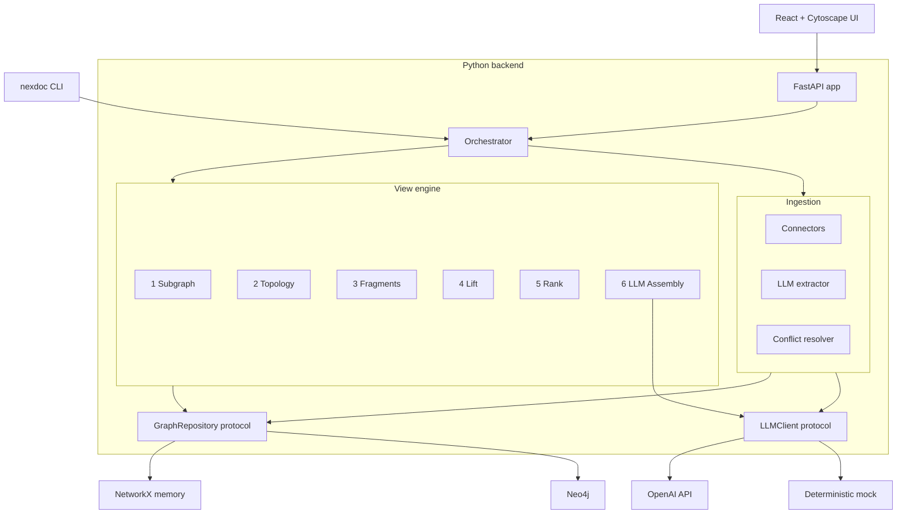

# NexusDocs

Topology-aware knowledge graph documentation. A Python + React platform that
turns your services, teams, and policies into a navigable knowledge graph and
renders it as a continuous-zoom narrative tailored to who is reading.

> **Status**: Phases 1–3 of the [PRD](PRD.md) are implemented.
> Foundation, LLM ingestion, and the topology-aware view engine are all live.
> Phase 4+ (Confluence/JIRA/OpenAPI/Backstage connectors, VS Code extension,
> impact analysis, drift detection, semantic search) are explicit Protocol
> seams in the codebase, ready to plug in.

---

## What you get

| Surface | Path | Notes |
|---|---|---|
| Python backend | [`backend/`](backend/) | Pydantic v2 models, FastAPI app, view engine, ingestion pipeline. |
| `nexdoc` CLI | [`backend/src/nexusdocs/cli/`](backend/src/nexusdocs/cli/) | `apply`, `render`, `search`, `ingest`, `serve`. |
| React frontend | [`frontend/`](frontend/) | Vite + React + TypeScript + Cytoscape.js + Mermaid. |
| Compose stack | [`docker-compose.yml`](docker-compose.yml) | API + Neo4j + UI + one-shot seed loader. |
| Documentation | [`docs/`](docs/README.md) | Concepts, schemas, framework, examples. |

---

## Quick start (Docker)

The fastest way to get a fully seeded environment with Neo4j as the persistent
backend.

```bash
cp .env.example .env       # edit if you want a real OpenAI key
make up                    # builds api + ui images, starts neo4j
                           #   waits for /healthz, runs the seed container,
                           #   then leaves the stack running.

# Open:
# - Web UI:        http://localhost:5173
# - API:           http://localhost:8080/api/v1
# - Health:        http://localhost:8080/healthz
# - OpenAPI:       http://localhost:8080/openapi.json
# - Neo4j Browser: http://localhost:7474   (neo4j / nexusdocs)
```

Tear down with `make down`. Re-seed Neo4j after schema changes with
`make seed`.

> Without `OPENAI_API_KEY` set, the assembly + extraction prompts fall back to
> the deterministic mock client so everything still works offline.

---

## Quick start (local Python)

```bash
make install               # creates backend/.venv with [dev] extras
make test                  # 60+ unit + integration tests
make dev                   # nexdoc serve --seed examples/payments-sample.yaml
```

Then in a second terminal:

```bash
make install-frontend
make dev-frontend          # vite dev server on :5173 with /api proxy
```

---

## CLI tour

```bash
# Apply a YAML graph definition (transactional; either everything succeeds
# or nothing is written)
nexdoc --state examples/payments-sample.yaml apply examples/payments-sample.yaml

# Render the payments team view at zoom 15 (director-level overview)
nexdoc --state examples/payments-sample.yaml render team.payments --zoom 15

# Render at zoom 65 (engineer-level details), with the debug lens
nexdoc --state examples/payments-sample.yaml render \
  service.payments-api --zoom 65 --lens debug

# Free-text search across the graph
nexdoc --state examples/payments-sample.yaml search "kafka throughput"

# Trigger an ingestion job from a Git repo
nexdoc ingest --git https://github.com/example/payments.git
```

JSON output for any command is one flag away:

```bash
nexdoc --json --state examples/payments-sample.yaml render team.payments --zoom 15
```

---

## Architecture



The orchestrator layer is the only entry point used by both the API and the
CLI, so the two surfaces stay in lockstep.

The view engine is a 6-step pipeline; each step is small, pure, and unit
tested. See [`docs/framework/view-engine.md`](docs/framework/view-engine.md)
for the canonical description.

---

## Development

| What | How |
|---|---|
| Run all backend tests | `make test` |
| Type-check backend | `make typecheck` |
| Lint / format backend | `make lint` / `make format` |
| Type-check frontend | `make test-frontend` |
| Build the UI for production | `cd frontend && npm run build` |
| Regenerate the TS API client | `cd frontend && npm run gen:api` (requires the API to be running on :8080) |

Tests that need Neo4j are marked `@pytest.mark.neo4j` and are skipped unless
`NEO4J_URI` etc. are set. Tests that need real OpenAI calls are marked
`@pytest.mark.openai`. Both markers default to *off* so `make test` runs
fully offline.

---

## Project layout

```
NexusDocs/
├── PRD.md                       # source of truth for the product
├── docs/                        # written narratives (concepts, schemas, framework)
├── examples/                    # YAML fixtures used by docker-compose seed
├── backend/                     # Python 3.12 — pyproject.toml + src + tests
├── frontend/                    # Vite + React + TypeScript
├── docker-compose.yml
├── .env.example
├── Makefile
└── README.md (this file)
```

---

## Documentation

The docs are organised by concern. Start here:

- [`docs/README.md`](docs/README.md) — table of contents.
- [`docs/concepts/`](docs/concepts/) — what the graph and the zoom axis are.
- [`docs/schemas/`](docs/schemas/) — every entity, relationship, fragment, and YAML envelope.
- [`docs/framework/`](docs/framework/) — view engine, ingestion, LLM integration, API.
- [`docs/examples/`](docs/examples/) — real user flows (director, debug, onboarding) backed by fixture data.

---

## License

See [LICENSE](LICENSE).
