# NexusDocs — Usage guide

> A step-by-step walkthrough of the NexusDocs UI and CLI, with screenshots at
> every turn. If you're brand-new to the project, start at the top and walk
> through; if you already know what you want, jump from the table of contents.

---

## Table of contents

1. [Bootstrapping](#1-bootstrapping)
   - [1.1 Boot the full stack with Docker](#11-boot-the-full-stack-with-docker)
   - [1.2 Boot a local dev loop without Docker](#12-boot-a-local-dev-loop-without-docker)
2. [Tour of the web UI](#2-tour-of-the-web-ui)
   - [2.1 The View page](#21-the-view-page)
   - [2.2 Sweeping the zoom axis](#22-sweeping-the-zoom-axis)
   - [2.3 Refocusing on a specific entity](#23-refocusing-on-a-specific-entity)
   - [2.4 Switching lenses](#24-switching-lenses)
   - [2.5 The Search page](#25-the-search-page)
   - [2.6 The Ingest page](#26-the-ingest-page)
   - [2.7 The Settings page](#27-the-settings-page)
   - [2.8 The Help & About pages](#28-the-help--about-pages)
3. [The `nexdoc` CLI](#3-the-nexdoc-cli)
   - [3.1 Global flags](#31-global-flags)
   - [3.2 `nexdoc apply`](#32-nexdoc-apply)
   - [3.3 `nexdoc render`](#33-nexdoc-render)
   - [3.4 `nexdoc search`](#34-nexdoc-search)
   - [3.5 `nexdoc ingest`](#35-nexdoc-ingest)
   - [3.6 `nexdoc serve`](#36-nexdoc-serve)
4. [End-to-end recipes](#4-end-to-end-recipes)
   - [4.1 “New on-call engineer” recipe](#41-new-on-call-engineer-recipe)
   - [4.2 “Director-level overview” recipe](#42-director-level-overview-recipe)
   - [4.3 “Ingest a markdown architecture doc” recipe](#43-ingest-a-markdown-architecture-doc-recipe)
   - [4.4 “Use a self-hosted LLM” recipe](#44-use-a-self-hosted-llm-recipe)
5. [Troubleshooting](#5-troubleshooting)
6. [Where to go next](#6-where-to-go-next)

---

## 1. Bootstrapping

### 1.1 Boot the full stack with Docker

This is the recommended path for first-time users. Docker brings up the API,
the React UI, Neo4j, and a one-shot seed loader that pre-populates the graph
with a 1.7k-entity synthetic “Acme” company so you have something interesting
to navigate from the very first page load.

```bash
git clone https://github.com/madpin/nexusdocs.git
cd nexusdocs

cp .env.example .env       # edit if you want a real OpenAI key
make up                    # builds api + ui images, starts neo4j,
                           # runs the seed container, then leaves the
                           # whole stack running.
```

Open the UI at <http://localhost:5173>. You should see something like this:

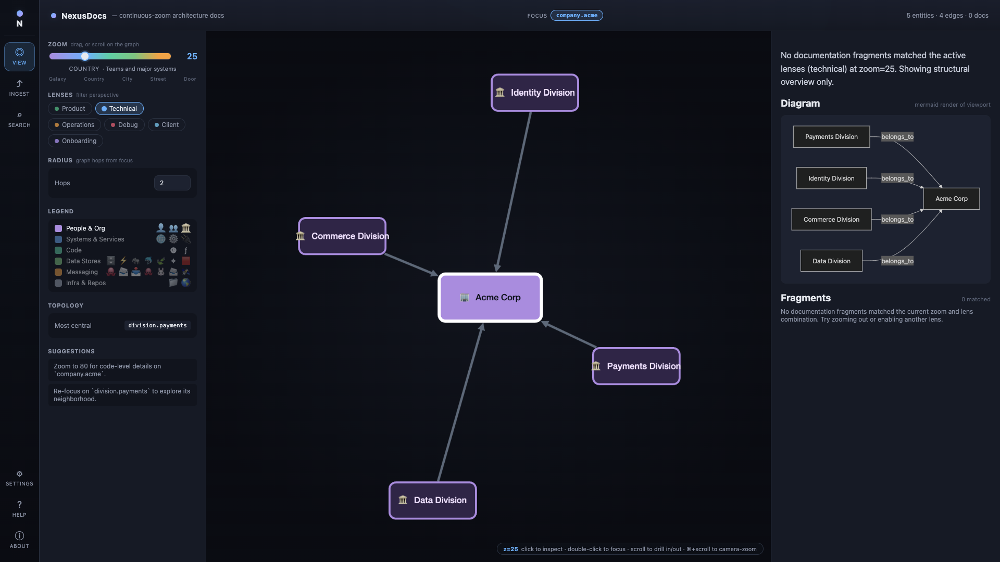

The **header** shows your current focus (`company.acme`) and graph stats
(*N* entities · *N* edges · *N* docs). The **left rail** is the global
navigation. The **left sidebar** has zoom, lenses, radius, legend and
topology highlights. The **center** is the Cytoscape graph canvas. The
**right pane** is the auto-generated narrative for the current viewport —
summary, Mermaid diagram, and DocFragments ranked by relevance.

If you don't see anything yet, wait a few seconds — Neo4j takes ~20 s to
boot the first time, then the seed container streams the YAML in.

> **No OpenAI key?** No problem. Without `OPENAI_API_KEY` set, the assembly
> and extraction prompts fall back to a deterministic mock client so every
> screen still works offline.

### 1.2 Boot a local dev loop without Docker

If you're hacking on the backend or the UI, run them natively:

```bash
make install               # creates backend/.venv with [dev] extras
make test                  # 60+ unit + integration tests
make dev                   # nexdoc serve --seed examples/payments-sample.yaml
```

Then in a second terminal:

```bash
make install-frontend
make dev-frontend          # vite dev server on :5173 with /api proxy
```

The dev loop uses the in-memory `NetworkX` repository instead of Neo4j and
seeds from the small `examples/payments-sample.yaml` fixture, so it boots in
under a second.

---

## 2. Tour of the web UI

### 2.1 The View page

The View page is the heart of NexusDocs. It always shows three things in
sync:

1. **The graph canvas** — a Cytoscape rendering of the subgraph around your
   current focus, at the current zoom.
2. **The narrative pane** — an LLM-assembled summary, Mermaid diagram and
   ranked DocFragments for that viewport.
3. **The sidebar controls** — zoom, lenses, radius, legend, topology
   highlights and follow-up suggestions.


The header tells you exactly what's loaded:

```text
focus: company.acme        5 entities · 4 edges · 0 docs
```

The little pill at the bottom of the canvas shows the current zoom and the
keyboard tips:

```text
z=25  click to inspect · double-click to focus · scroll to drill in/out · ⌘+scroll to camera-zoom
```

### 2.2 Sweeping the zoom axis

The zoom slider is **the** core control. It ranges from `0` (galaxy view) to
`100` (line of code). Every DocFragment declares the zoom range it's
relevant for, and the engine only includes fragments whose
`zoom_min ≤ z ≤ zoom_max`.

Try sliding through the same focus (`company.acme`) at four altitudes:

| Step | Zoom | What you see |
|---|---|---|
| 1 | **10** — galaxy | Just `Acme Corp` and the divisions that matter at the very top. |
| 2 | **25** — country | Default. Major divisions/systems. |
| 3 | **50** — city | Teams and services begin to crowd in. |
| 4 | **80** — street | Individual services, queues and endpoints, dense edges. |

#### Zoom 10 — *galaxy*

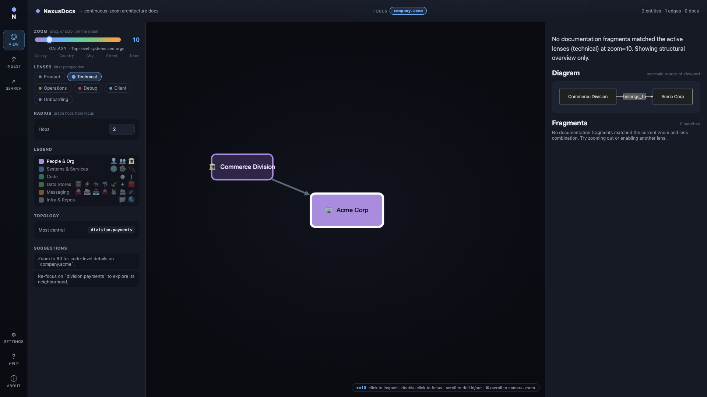

Only the highest-level orgs make the cut. Great for a CEO/CTO eye-view.

#### Zoom 25 — *country*


The default. The four divisions of Acme show up around the company node.

#### Zoom 50 — *city*

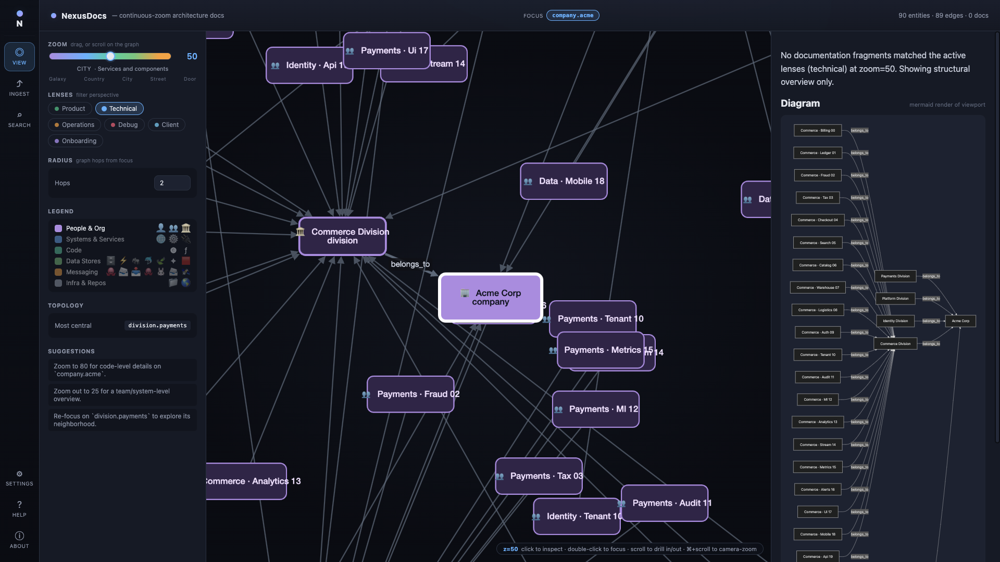

Now you can see specific teams (Payments, Identity, Commerce, Data) and
their direct neighbors. Notice the topology section in the sidebar
highlighting `division.payments` as the most central node.

#### Zoom 80 — *street*

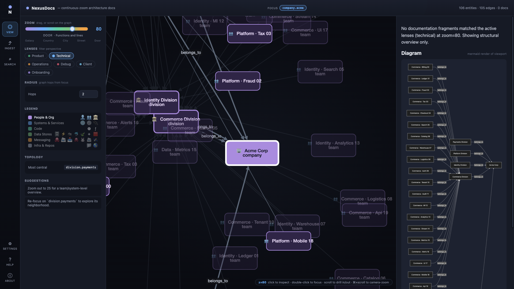

Services, individual platforms, dense edges. The Mermaid panel on the right
keeps pace, showing the full structural diagram of what's on screen.

> **Tip — the camera vs. the zoom axis.** Mouse-scrolling on the canvas
> drives the **zoom axis** (changes which entities and fragments are
> included). Hold `⌘` (macOS) or `Ctrl` (Windows/Linux) while scrolling to
> pan/zoom the **camera** (just changes how big things look on screen).

### 2.3 Refocusing on a specific entity

Click any node in the graph to **inspect** it (the right pane fills with a
details card). Double-click it to **refocus** on it — the whole view
re-renders centered on that entity.

You can also refocus from the Search page (see 2.5) or by clicking the
"Most central" link in the topology section of the sidebar.

Here's the View page focused on `system.payments` (Acme's "Billing
Platform") at zoom 40:

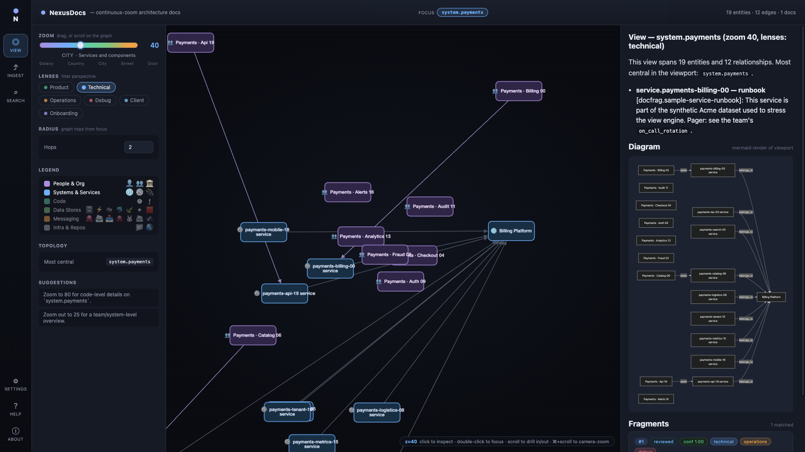

Notice the differences from the default view:

- The header now reads `focus: system.payments`.
- The summary in the right pane describes this specific system.
- The fragments panel surfaces a **runbook** anchored to one of the
  payments services.
- The topology panel still flags `system.payments` as central — within this
  viewport it dominates.

### 2.4 Switching lenses

Lenses are perspective filters. Each DocFragment declares which lenses it's
useful under — a runbook is `operations`, an API contract is `technical`, an
on-call doc is `debug`, and so on.

Toggle the chips in the sidebar to filter which fragments are eligible for
the current view. You can combine multiple lenses; you can't disable the
last one.

Same focus as before, now with `technical` + `operations` + `debug` all on:

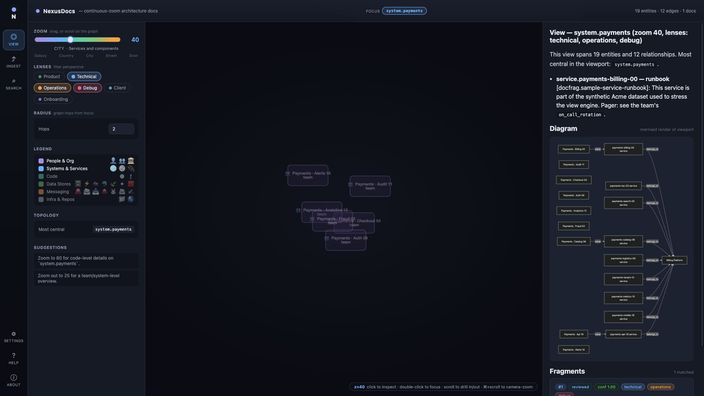

The graph topology is identical, but the right pane now mixes in
operational and debug fragments. Notice the chips in the Lenses section all
glow.

### 2.5 The Search page

Click the **Search** icon (`⌕`) in the navigation rail (or press `/` from
anywhere). You get a global search that crosses entities, relationships and
fragments.

Type a partial entity name — e.g. `payments-api`:

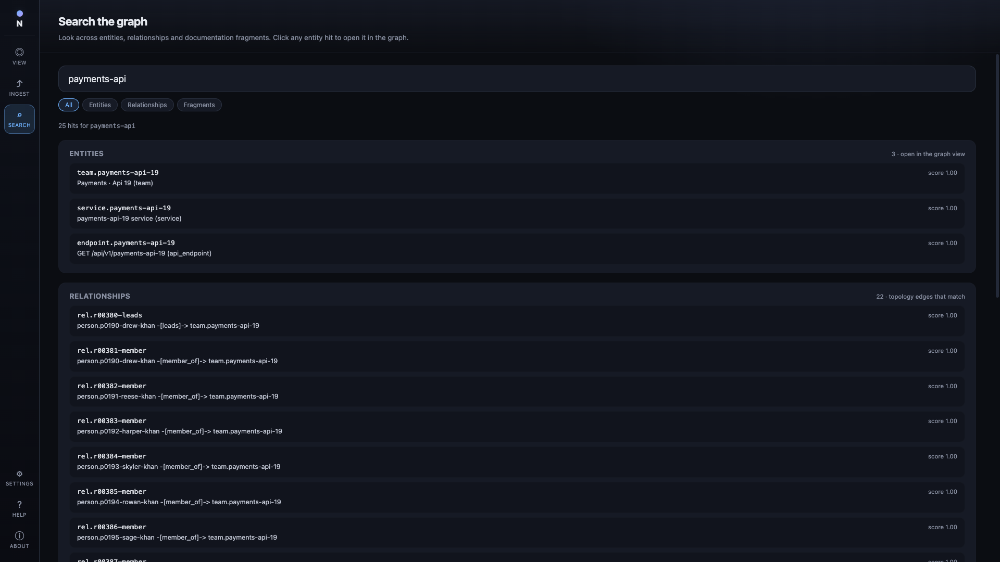

You get three groups:

- **Entities** — clickable. Clicking one focuses the graph view on it.
- **Relationships** — the topology edges that match.
- **Fragments** — the documentation chunks that match.

The scope chips at the top (`All` / `Entities` / `Relationships` /
`Fragments`) narrow the result set when you only care about one kind.

Try `runbook` to surface fragments mentioning runbooks across the whole
graph:

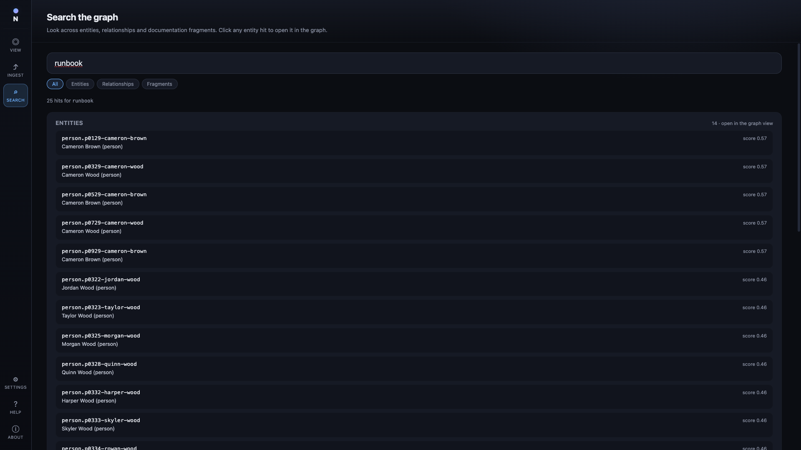

### 2.6 The Ingest page

The Ingest page is how you add documentation to the graph at runtime. There
are four tabs, all sharing the same extraction pipeline:

| Tab | Use it for |
|---|---|
| **Markdown** | Paste any markdown / plain-text doc. Best for quick experiments. |
| **Git Repository** | Clone any git URL; the connector walks READMEs, `docker-compose.yml`, `*.proto`, OpenAPI specs, etc. |
| **Confluence** | Pull a single page from Atlassian Confluence Cloud or Server. |
| **Jira** | Pull a single issue (summary, description, comments). |

Here's the Markdown tab with the sample paste loaded:

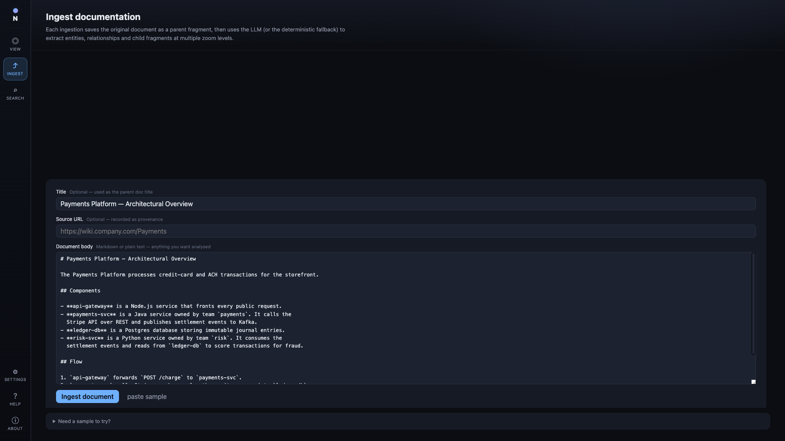

What happens when you click **Ingest document**:

1. The original text is stored verbatim as a **parent fragment** (so you
   never lose the source).
2. The LLM (or the deterministic fallback) extracts entities, relationships
   and **child fragments** at multiple zoom levels.
3. Each extracted item gets full provenance: source type, source path,
   confidence score, generator (`human` / `llm` / `hybrid`).
4. The Recent jobs panel updates live with the result; you can click
   "open the graph view" to see what got created.

Here's the Git tab, with the four ingestion connectors visible:

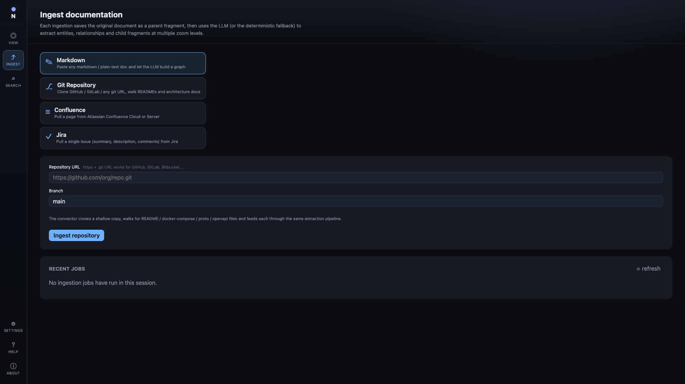

For Confluence and Jira you'll need a base URL (e.g.
`https://your-org.atlassian.net/wiki`), the page or issue ID, and an API
token.

### 2.7 The Settings page

The Settings page is where you inspect the live runtime config and override
the LLM bindings without restarting the API.

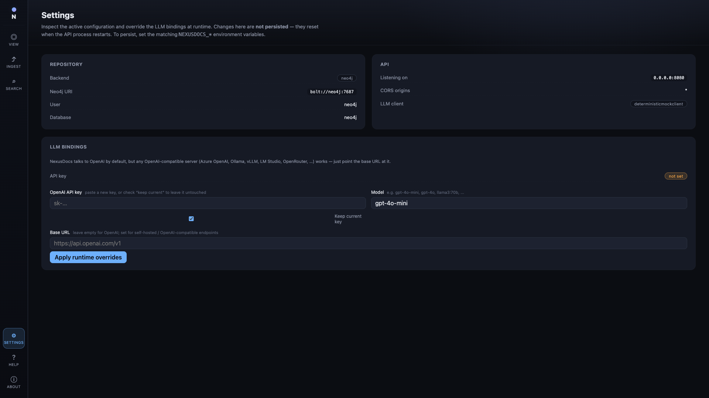

Three panels:

- **Repository** — what graph backend is in use (`memory` or `neo4j`),
  Neo4j URI, user, database.
- **API** — the host/port the API is listening on, CORS origins, and which
  LLM client class is currently loaded (`OpenAIClient` or
  `DeterministicMockClient`).
- **LLM bindings** — paste a new OpenAI API key, change the model, point at
  any OpenAI-compatible endpoint (Azure OpenAI, Ollama, vLLM, LM Studio,
  OpenRouter, …).

Changes here are **not persisted** — they reset when the API process
restarts. To persist, set the matching `NEXUSDOCS_*` environment variables
in `.env` and recreate the stack.

### 2.8 The Help & About pages

The **Help** page is a one-page glossary of every term you'll meet across
the app. Skim it once and the rest of the UI clicks into place.

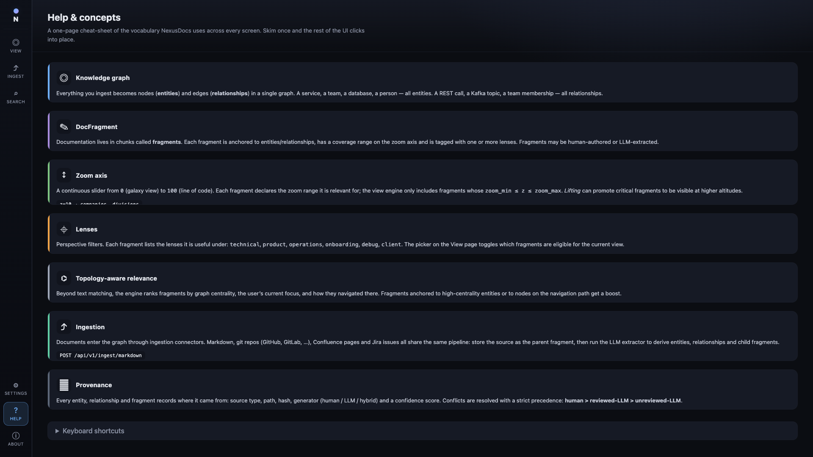

The **About** page shows live counts of what's in your graph right now —
total entities, relationships and fragments, plus a histogram of entities
by kind and fragments by lens.

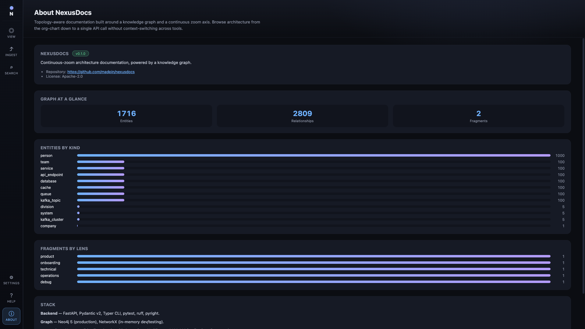

It's also where you'll find the version, repo link, and a one-paragraph
description of the stack.

---

## 3. The `nexdoc` CLI

`nexdoc` is the same orchestrator as the API, exposed as a Typer-based
command-line tool. It's installed automatically when you `make install`.

### 3.1 Global flags

Every `nexdoc` invocation supports two global options before the
subcommand:

```text
$ nexdoc --help

 Usage: nexdoc [OPTIONS] COMMAND [ARGS]...

 Topology-aware knowledge graph documentation.

╭─ Options ─────────────────────────────────────────────────────────────────╮
│ --state               -s      PATH  Path to a YAML file (or directory)    │
│                                     used as the graph state. Reloaded at  │
│                                     the start of every command for        │
│                                     offline use. Set NEXUSDOCS_STATE_PATH │
│                                     to make this persistent.              │
│                                     [env var: NEXUSDOCS_STATE_PATH]       │
│ --json                              Emit JSON instead of pretty output.   │
│ --install-completion                Install completion for the current    │
│                                     shell.                                │
│ --show-completion                   Show completion script.               │
│ --help                              Show this message and exit.           │
╰───────────────────────────────────────────────────────────────────────────╯
╭─ Commands ────────────────────────────────────────────────────────────────╮
│ apply   Apply a YAML file to the graph.                                   │
│ render  Render a view.                                                    │
│ search  Search the graph.                                                 │
│ ingest  Trigger ingestion of a remote source.                             │
│ serve   Run the HTTP API.                                                 │
╰───────────────────────────────────────────────────────────────────────────╯
```

- `--state` / `-s` tells the CLI which YAML file (or directory of YAMLs) to
  load before each command. Without it, the CLI uses an empty in-memory
  repository for that single invocation. Set `NEXUSDOCS_STATE_PATH` to
  avoid passing it every time.
- `--json` switches every command from pretty Rich output to machine-readable
  JSON. Pipe it into `jq` for scripting.

### 3.2 `nexdoc apply`

Loads a YAML file (or every `*.yaml` / `*.yml` file in a directory) into
the graph. Transactional — if any document fails to validate, **nothing**
is written.

```text
$ nexdoc apply --help

 Usage: nexdoc apply [OPTIONS] PATH

 Apply a YAML file to the graph.

╭─ Arguments ─────────────────────────────────────────────╮
│ *    path      PATH  Path to a YAML file or directory.  │
╰─────────────────────────────────────────────────────────╯
```

Example:

```bash
nexdoc --state examples/payments-sample.yaml apply examples/payments-sample.yaml
```

```text
                                Applied
┏━━━━━━━━━━━━━━┳━━━━━━━━━━━━━━━━━━━━━━━━━━━━━━━━━━━━━┳━━━━━━━━━┓
┃ Kind         ┃ ID                                  ┃ Action  ┃
┡━━━━━━━━━━━━━━╇━━━━━━━━━━━━━━━━━━━━━━━━━━━━━━━━━━━━━╇━━━━━━━━━┩
│ Entity       │ company.acme                        │ updated │
│ Entity       │ division.fintech                    │ updated │
│ Entity       │ team.payments                       │ updated │
│ Entity       │ service.payments-api                │ updated │
│ Relationship │ rel.payments-api-calls-auth         │ updated │
│ DocFragment  │ docfrag.kafka-throughput-ceiling    │ updated │
│ ViewPreset   │ preset.payments-oncall-debug        │ updated │
└──────────────┴─────────────────────────────────────┴─────────┘
```

### 3.3 `nexdoc render`

The CLI counterpart to the View page.

```text
$ nexdoc render --help

 Usage: nexdoc render [OPTIONS] FOCUS

 Render a view.

╭─ Arguments ─────────────────────────────────────────────────────╮
│ *    focus      TEXT  Focus entity ID. [required]               │
╰─────────────────────────────────────────────────────────────────╯
╭─ Options ───────────────────────────────────────────────────────╮
│ --zoom      -z      INTEGER RANGE [0<=x<=100]  [default: 50]    │
│ --lens      -l      TEXT                       Lens (repeatable)│
│ --radius    -r      INTEGER RANGE [x>=0]       [default: 2]     │
│ --top-k     -k      INTEGER RANGE [x>=1]       [default: 10]    │
│ --protocol          TEXT                                        │
│ --tag               TEXT                                        │
╰─────────────────────────────────────────────────────────────────╯
```

Examples:

```bash
# Director-level overview of the payments team
nexdoc --state examples/payments-sample.yaml render team.payments --zoom 25

# Engineer-level details on the payments-api with two lenses
nexdoc --state examples/payments-sample.yaml render \
  service.payments-api --zoom 65 --lens technical --lens debug

# Filter the subgraph to REST relationships only
nexdoc --state examples/payments-sample.yaml render \
  service.payments-api --zoom 65 --protocol rest

# Get JSON for downstream tooling
nexdoc --json --state examples/payments-sample.yaml render \
  team.payments --zoom 35 | jq '.fragments | length'
```

A typical pretty-printed render looks like this:

```text
╭───────────────────────────── Summary ─────────────────────────────╮
│ View — service.payments-api (zoom 65, lenses: technical, debug)   │
│                                                                   │
│ This view spans 10 entities and 10 relationships. Most central in │
│ the viewport: service.auth.                                       │
│                                                                   │
│  • Kafka publisher throughput ceiling: core-kafka-prod is sized   │
│    for ~50k msgs/sec aggregate. Individual topics are capped at   │
│    8k msgs/sec by the cluster-wide quota. …                       │
│  • Failure modes: Payments → Auth REST: Auth Service rate-limits  │
│    to 500 req/s per consumer. Circuit breaker trips after 3       │
│    consecutive 429s and opens for 30s. …                          │
│  • Payments API — local setup: 1. Clone the repo. 2. make         │
│    bootstrap installs Go and seeds a local Postgres. …            │
╰───────────────────────────────────────────────────────────────────╯
╭──────── Diagram (Mermaid) ────────╮
│ graph LR                          │
│   n0["Payments API"]              │
│   n1["Auth Service"]              │
│   n2["order.events.v1"]           │
│   n3["Transactions DB"]           │
│   n0 -->|calls_api/rest| n1       │
│   n0 -->|publishes_to/kafka| n2   │
│   n0 -->|writes_to/postgres| n3   │
╰───────────────────────────────────╯
                          Fragments
┏━━━━┳───────────────────────────────┳────────┳──────┳──────────┓
┃ Rk ┃ Title                         ┃ Lifted ┃ Conf ┃ Reviewed ┃
┡━━━━╇───────────────────────────────╇────────╇──────╇──────────┩
│  1 │ Kafka publisher throughput …  │        │ 0.95 │    ✓     │
│  2 │ Failure modes: Payments → …   │        │ 1.00 │    ✓     │
│  3 │ Payments API — local setup    │        │ 0.78 │          │
└────┴───────────────────────────────┴────────┴──────┴──────────┘
Most central: service.auth
→ Zoom to 80 for code-level details on `service.payments-api`.
→ Zoom out to 25 for a team/system-level overview.
→ Re-focus on `service.auth` to explore its neighborhood.
```

### 3.4 `nexdoc search`

Free-text search across entities, relationships and fragments.

```text
$ nexdoc search --help

 Usage: nexdoc search [OPTIONS] QUERY

 Search the graph.

╭─ Options ─────────────────────────────────────────────────────────╮
│ --scope        [entities|relationships|fragments|all]             │
│                                                  [default: all]   │
│ --limit        INTEGER RANGE [x>=1]              [default: 25]    │
╰───────────────────────────────────────────────────────────────────╯
```

```bash
nexdoc --state examples/payments-sample.yaml search "kafka throughput"
```

```text
                        Search: 'kafka throughput' (all)
┏━━━━━━━━━━━━━━┳━━━━━━━━━━━━━━━━━━━━━━━━━━━┳━━━━━━━┳━━━━━━━━━━━━━━━━━━━━━━━━━━━┓
┃ Kind         ┃ ID                        ┃ Score ┃ Snippet                   ┃
┡━━━━━━━━━━━━━━╇━━━━━━━━━━━━━━━━━━━━━━━━━━━╇━━━━━━━╇━━━━━━━━━━━━━━━━━━━━━━━━━━━┩
│ fragment     │ docfrag.kafka-throughput… │  0.94 │ `core-kafka-prod` is …    │
│ entity       │ kafka_cluster.core-kafka… │  0.56 │ Core Kafka (prod) (kafka… │
│ fragment     │ docfrag.payments-api-loc… │  0.56 │ 1. Clone the repo. 2. …   │
│ fragment     │ docfrag.payments-team-ov… │  0.50 │ Team Payments builds and… │
│ entity       │ topic.user-events         │  0.48 │ user.events.v1 (kafka_t…  │
└──────────────┴───────────────────────────┴───────┴───────────────────────────┘
```

### 3.5 `nexdoc ingest`

Trigger an ingestion job from a Git repository.

```text
$ nexdoc ingest --help

 Usage: nexdoc ingest [OPTIONS] REPO_URL

 Trigger ingestion of a remote source.

╭─ Arguments ──────────────────────────────────────────────────────╮
│ *    repo_url      TEXT  Git repository URL. [required]          │
╰──────────────────────────────────────────────────────────────────╯
╭─ Options ────────────────────────────────────────────────────────╮
│ --branch        TEXT  [default: main]                            │
╰──────────────────────────────────────────────────────────────────╯
```

```bash
nexdoc ingest https://github.com/example/payments.git --branch main
```

For markdown / Confluence / Jira ingestion, use the [Ingest page in the
UI](#26-the-ingest-page) or the `POST /api/v1/ingest/{markdown,confluence,jira}`
HTTP endpoints — they're not currently surfaced as CLI subcommands.

### 3.6 `nexdoc serve`

Run the FastAPI app.

```text
$ nexdoc serve --help

 Usage: nexdoc serve [OPTIONS]

 Run the HTTP API.

╭─ Options ─────────────────────────────────────────────────────────╮
│ --host        TEXT     [default: 0.0.0.0]                         │
│ --port        INTEGER  [default: 8080]                            │
│ --seed        PATH     YAML file or directory to seed the         │
│                        in-memory repo.                            │
╰───────────────────────────────────────────────────────────────────╯
```

```bash
# Local dev: in-memory repo seeded from a YAML
nexdoc serve --seed examples/payments-sample.yaml --port 8080

# Production: pick up Neo4j credentials from NEXUSDOCS_* env vars
NEXUSDOCS_REPOSITORY_BACKEND=neo4j \
NEXUSDOCS_NEO4J_URI=bolt://neo4j:7687 \
NEXUSDOCS_NEO4J_PASSWORD=secret \
nexdoc serve --port 8080
```

---

## 4. End-to-end recipes

### 4.1 “New on-call engineer” recipe

> *I just joined the payments on-call rotation and I need to understand the
> service I'm now responsible for.*

1. **Boot the stack**: `make up`. Wait for the Docker output to show
   `seeded`.
2. **Open the UI**: <http://localhost:5173>.
3. **Search for the service**:
   - Click the **Search** icon (`⌕`) in the left rail.
   - Type `payments-api`.
   - Click `service.payments-api-19`. The View page opens focused on it.
4. **Pick the right altitude**: drag the zoom slider to **65** (functions &
   lines).
5. **Toggle on the right lenses**: in the sidebar Lenses section, enable
   `operations` and `debug` (in addition to the default `technical`).
6. **Read the right pane** — you'll see:
   - A summary explaining what this service does and who owns it.
   - A Mermaid diagram of its direct dependencies.
   - DocFragments ranked by relevance: failure modes, throughput ceilings,
     local-dev setup, etc.
7. **Follow the topology**: the sidebar will flag the most central node and
   any structural concerns. Click them to refocus and dig deeper.

Same recipe via the CLI:

```bash
nexdoc --state examples/payments-sample.yaml render \
  service.payments-api --zoom 65 --lens technical --lens debug --lens operations
```

### 4.2 “Director-level overview” recipe

> *I'm a director who wants the org-chart-and-systems view. No code-level
> noise.*

1. Open <http://localhost:5173>. Default focus is `company.acme` at
   zoom 25 — already a good starting point.
2. Drag the zoom slider down to **15** for an even higher altitude.
3. Keep only the `product` lens on (deselect the others).
4. The right pane gives you the systems-and-divisions narrative; the canvas
   shows just the structurally significant entities.

CLI:

```bash
nexdoc --state examples/payments-sample.yaml render company.acme \
  --zoom 15 --lens product
```

### 4.3 “Ingest a markdown architecture doc” recipe

> *I have a 2-page markdown describing my system. I want it in the graph.*

1. Click **Ingest** (`⤴`) in the left rail.
2. Make sure the **Markdown** tab is selected.
3. (Optional) Click **paste sample** to fill the form with the bundled
   sample. Otherwise paste your own document into "Document body".
4. Optionally fill **Title** (used as the parent doc title) and
   **Source URL** (recorded as provenance).
5. Click **Ingest document**.


Within a few seconds you'll see a result card showing how many docs,
entities (new + updated), relationships and fragments were created. The
**parent fragment** holds your original markdown verbatim — provenance
preserved. Open the Recent jobs panel on the right to see the full audit
trail.

To programmatically do the same thing:

```bash
curl -X POST http://localhost:8080/api/v1/ingest/markdown \
  -H 'Content-Type: application/json' \
  -d @- <<'JSON'
{
  "title": "Payments Platform — Architectural Overview",
  "text": "# Payments Platform\n\nThe Payments Platform consists of...\n",
  "source_path": "https://wiki.company.com/Payments"
}
JSON
```

### 4.4 “Use a self-hosted LLM” recipe

> *I run Ollama locally / a corporate Azure OpenAI tenant / OpenRouter, and
> I want NexusDocs to call that instead of api.openai.com.*

Two ways:

#### Persistent (via env vars)

Edit `.env` and recreate the stack:

```bash
# .env
OPENAI_API_KEY=ollama        # any non-empty string for Ollama
OPENAI_MODEL=llama3:70b
OPENAI_BASE_URL=http://host.docker.internal:11434/v1
```

Then `make downup` to apply.

#### Runtime (no restart)

Open the **Settings** page, fill the LLM bindings panel, click **Apply
runtime overrides**:


The badge above the form will switch from "not set" to "configured" and the
**LLM client** badge in the API panel will flip from
`DeterministicMockClient` to `OpenAIClient`. Runtime overrides are lost on
the next API restart — use env vars for persistence.

---

## 5. Troubleshooting

| Symptom | Likely cause | Fix |
|---|---|---|
| `make up` exits with `Cannot connect to the Docker daemon` | Docker Desktop isn't running. | Start Docker Desktop, retry. |
| UI loads but graph is empty | Seed container hasn't finished, or Neo4j wasn't healthy. | `docker compose logs seed` — re-run `make seed` if needed. |
| `OpenAIClient` fails with 401 | Invalid API key. | Update `OPENAI_API_KEY` in `.env` and `make downup`, or change it on the Settings page. |
| Backend tests fail with `neo4j.driver` errors | You set `NEO4J_URI` but Neo4j isn't running. | `unset NEO4J_URI` to skip the marker, or boot Neo4j first. |
| CLI `apply` fails: "no such file" | Wrong working directory. | The path is relative; `cd` to the repo root or use an absolute path. |
| The "About" page shows zero entities | The repository is empty. | `make seed` (Docker) or `nexdoc apply examples/payments-sample.yaml` (local). |
| Canvas zoom lost when reloading the page | The View store doesn't currently persist to URL/localStorage. | Use the Search page to refocus, or restart the Vite dev server. |

---

## 6. Where to go next

- **[Concepts](concepts/README.md)** — formal definitions of the graph model,
  zoom axis, lenses, topology and navigation.
- **[Schemas](schemas/README.md)** — every entity, relationship, fragment and
  view-preset YAML schema.
- **[Framework](framework/README.md)** — how the view engine, ingestion
  pipeline and LLM integration are wired together internally.
- **[Examples](examples/README.md)** — real, reproducible user flows backed
  by the bundled fixtures.
- **[PRD](../PRD.md)** — the product requirements doc that drives the
  roadmap.

If you find a missing screenshot, an out-of-date step, or a screen that's
been redesigned, please open an issue (or a PR) — these docs live next to
the code on purpose so they can stay in lockstep.
